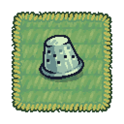

## Overall Style

The overall style of Threadbare is:

* Cartoony, not realistic, illustrations.
* With depth and dimension. Not flat.
* High resolution pixel art.

This can be hard to explain in words. The best reference are the existing assets!

Initially based on artist Pixel Frog and his asset pack "Tiny Swords". Further developed by Pixel Frog himself exclusively for Threadbare.

Note: The asset creation for StoryQuests are more flexible and can have their own aesthetic, so they don't have to follow these guides. Still these guides can be a good reference for the StoryQuests.

## Image file format

Please use PNG for all image assets.

## Threadbare's take on Pixel Art

Nowadays, pixel art is a visual style, not a hardware limitation. Some games try hard to look retro by enforcing rules, while other games consciously break them. Threadbare fits among the latter. It is not a "pure" pixel art game. So it is not pixel perfect, and doesn't have a limited palette. To some extent, scaling and rotation of sprites is allowed.
