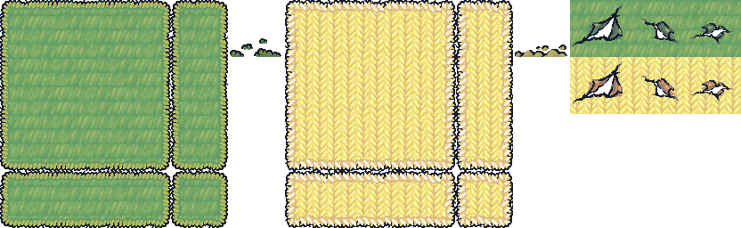
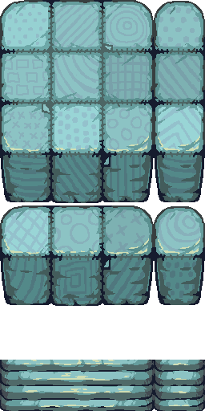
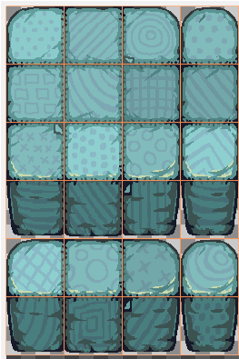

* Tiles are 64 x 64 pixels size.
* The default tileset has the following 16 tiles format. It is often called "reduced" for being a reduced version of the 47 tiles format.

  

- - -

* Elevations have 2 more rows, leading to 24 tiles:

* Please note that they are squares, even if the drawing inside is in a top-down perspective, just like characters and props.

