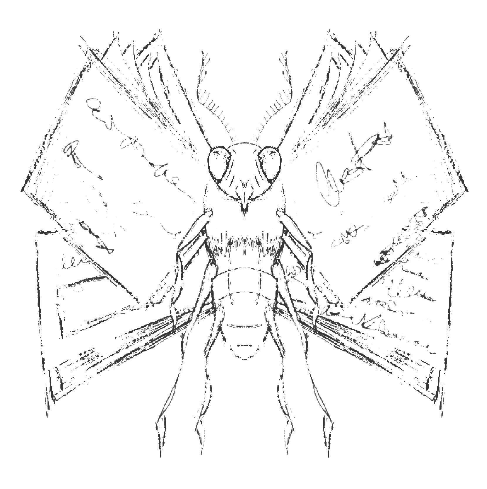
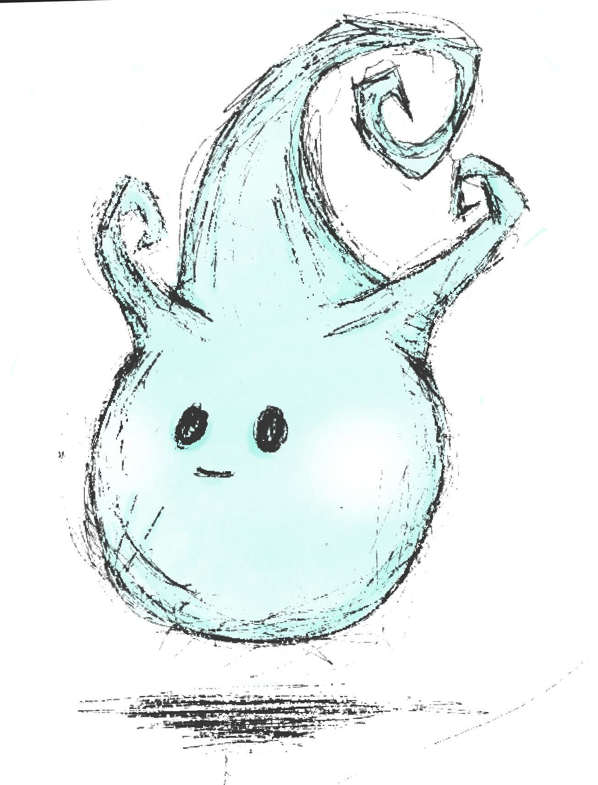
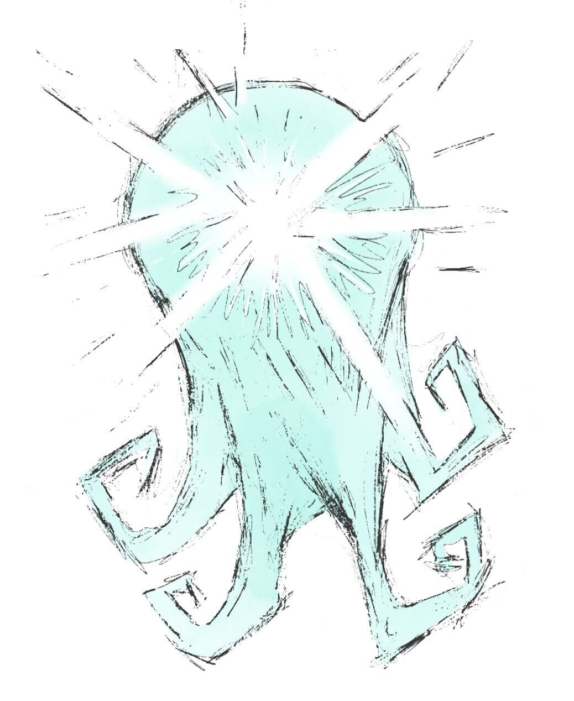

Memory Moths
------------

{ width="50%" }

These tiny flying creatures have pages for wings, and carry the missing parts of
unfinished stories to the StoryWeavers.

Wish Wisps
----------

{ width="40%" }
{ width="40%" }

These can be used as a light in dark places, as well as granting the
Storyweavers a single wish. The choice of wishes depends on the story they are
currently a part of.
