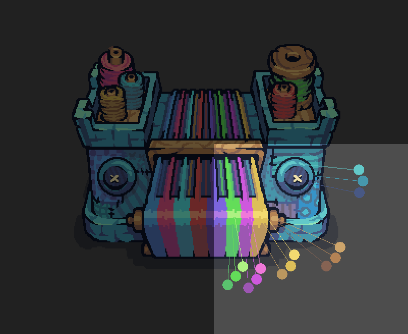
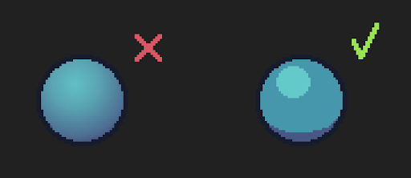
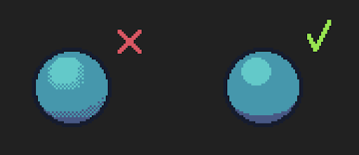

# Color Palette and Cel Shading

Colors are not taken from a limited palette like in retro games, so feel free to pick any color. But the rendering of objects is usually done with 3 colors: the main fill color, a light variant and a dark variant. This is called cel shading.

No soft shading! Use only 3 colors.

No dithering! Dithering is a method for pixel artwork with a limited palette to create blending shades with few colors. Threadbare doesn't use dithering.

Top lighting: When you do the 3-colors cel shading, imagine the sun is lighting the objects from above.

