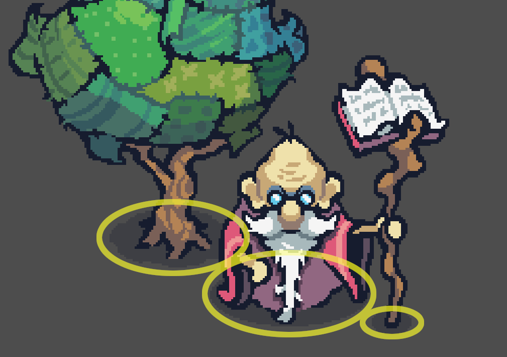
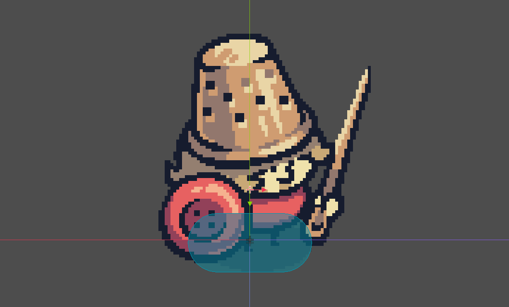
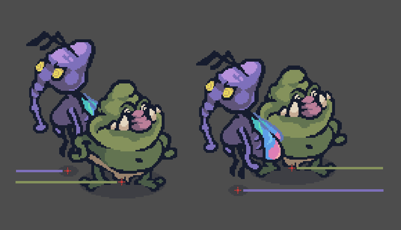

# Threadbare's Perspective

Top-down like isometric Zelda games. Imagine that the camera is in a diagonal floating above the characters. Something flat on the floor should be about 3 times wider than it is taller. Take for instance the character shadows:

This is why in the Godot Editor the character collisions are approximated with a capsule shape covering their shadow, placed between the characters feet:

Fake perspective. There is no 3D calculation involved. The perspective is an illusion, achieved using Y-sorting in the Godot Engine: The game entities are ordered according to their Y position. So if node A has its pivot point above node B, A will be behind B.

Please make sure that the characters and props you create have their origin of coordinates at their contact point with the ground. For a character this would be between their feet.
